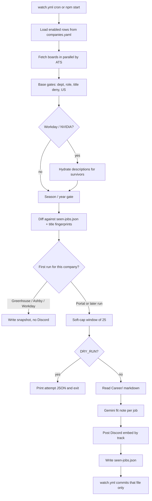
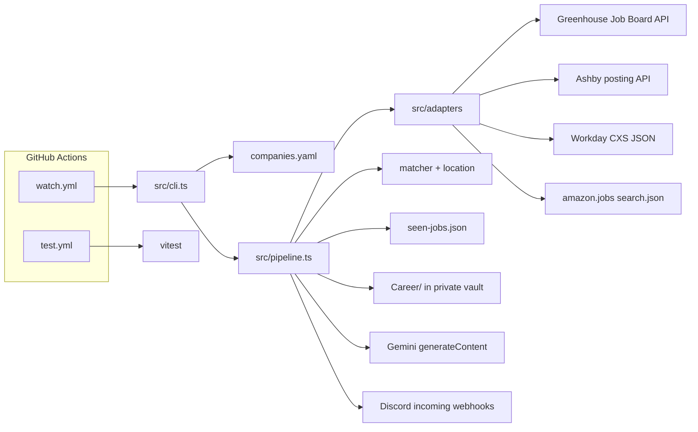

# pinger

[](https://github.com/tomiwaaluko/pinger/actions/workflows/test.yml)

A personal GitHub Actions watcher that polls public job-board JSON APIs a few times a day and posts new **intern / co-op** and **new-grad** Software Engineer or AI Engineer openings to Discord, with a short Gemini fit note from a private Career folder.

There is no web UI, no database, and no always-on host. Discord is the interface; Actions logs are the ops console.

## Overview

Early-career SWE and AI roles appear and fill quickly. Refreshing dozens of career sites by hand is easy to miss, and aggregator lists often lag or rewrite URLs.

pinger watches **first-party ATS JSON** (Greenhouse, Ashby, Workday, plus Amazon / NVIDIA / OpenAI adapters) for companies in `companies.yaml`. It keeps only US, early-career SWE/AI jobs, dedupes repeats (including multi-location clones), and pings two Discord channels: internships vs everything else that still looks new-grad.

It is a **single-user** tool. Config is YAML in git. State is `seen-jobs.json` committed by the watch workflow. Gemini is called only for jobs that are actually posted, and only when `Career/` is non-empty and `GEMINI_API_KEY` is set.

## Key Features

- **Scheduled polling** on GitHub Actions (`0 12,17,23 * * *` UTC) plus manual `workflow_dispatch`
- **Multi-ATS adapters** for Greenhouse, Ashby, and Workday; portal adapters for Amazon, NVIDIA (Workday-backed), and OpenAI (Ashby-backed)
- **Deterministic matcher** in code: departments, role phrases, mid/senior title denies, US location, 2027 season/year rules
- **Split Discord routing:** intern/co-op titles → intern webhook; other matching SWE/AI titles → new-grad webhook
- **First-run silence** per company for ATS boards (snapshot without flooding Discord); portal adapters backfill matches on first run instead
- **Soft cap of 25 posts per run**, filling intern and high-signal new-grad titles before yearless bare SWE, round-robin across companies
- **Fingerprint collapse** so the same role in several cities is one ping, with sibling job IDs recorded together
- **Gemini fit notes** from a sandboxed `Career/` folder in a private vault repo; posts still go out with a fallback if the key is missing or the call fails
- **Partial failure isolation:** one bad board does not stop the fleet; a mid-run Discord failure records successful posts and exits `2`
- **Dry-run mode** that prints the would-be 25-window without Discord, Gemini, or `seen-jobs.json` writes
- **Manual Simplify coverage checklist** to compare enabled boards against public Simplify listings (does not ping Discord)

## How It Works



Live runs that actually post:

1. Load `companies.yaml` and fetch only `enabled: true` companies.
2. Keep jobs that pass department, title, US location, and season/year rules.
3. Collapse multi-location clones and skip IDs or fingerprints already in `seen-jobs.json`.
4. On an ATS company's **first run**, persist that company's key and matching IDs, and send nothing to Discord.
5. On later hits (or a portal first run), take up to 25 jobs, hydrate remaining empty Workday bodies in that window, generate fit notes, and post embeds whose URL is the job's `absoluteUrl`.

## Architecture



| Piece | Role |
| --- | --- |
| `src/cli.ts` | Process entry: env, config path, exit code |
| `src/pipeline.ts` | Fetch, match, first-run policy, cap, vault, Discord, seen-store merge |
| `src/adapters/` | One adapter per ATS; NVIDIA wraps Workday, OpenAI wraps Ashby |
| `src/matcher.ts` / `src/location.ts` | All keep/drop rules |
| `src/seen-store.ts` / `src/job-fingerprint.ts` | Per-company ID store plus title-fingerprint dedupe |
| `src/soft-cap.ts` | 25-job attempt window |
| `src/vault.ts` / `src/fit-note.ts` / `src/discord.ts` | Career markdown → Gemini → Discord embed |
| `seen-jobs.json` | Durable state, committed only by `watch.yml` |
| Private vault repo | Obsidian (or any) markdown under `Career/`; sparse-checked out at run time |

Google, Meta, Microsoft, and Apple have **empty portal stubs** in code (`listJobs` returns `[]`) and are stored in `companies.yaml` as `ats: custom`, which config validation will not allow to be enabled.

## Tech Stack

| Layer | Technology |
| --- | --- |
| Runtime | Node.js 22 (`engines.node`: `>=22`), TypeScript (`^5.8` in `package.json`), ESM |
| App | CLI compiled with `tsc` to `dist/cli.js` |
| Config / YAML | `yaml` (`^2.9`); `companies.yaml` |
| Tests | Vitest (`^3.2`), Node environment, offline fakes and JSON fixtures |
| AI | Google Gemini (`generativelanguage.googleapis.com`), model id from `llm.model` (currently `gemini-2.5-flash`) |
| Hosting | GitHub Actions (`ubuntu-latest`); no container, no cloud VM |
| Notifications | Discord incoming webhooks |
| Career context | Private git repo sparse-checkout of `Career/` |

Production runtime dependencies are only `yaml`. Vitest, TypeScript, and `@types/node` are devDependencies.

## Repository Structure

```text
src/
├── cli.ts                 # entrypoint
├── pipeline.ts            # watch run orchestration
├── config.ts              # companies.yaml loader / validation
├── matcher.ts             # keep/drop + intern vs new-grad track
├── location.ts            # US location heuristics
├── seen-store.ts          # seen-jobs.json IO
├── job-fingerprint.ts     # multi-location collapse
├── soft-cap.ts            # 25-job fair window
├── vault.ts / fit-note.ts / discord.ts
├── simplify-coverage.ts   # manual Simplify checklist
└── adapters/              # greenhouse, ashby, workday, amazon, nvidia, openai
tests/                     # Vitest; fixtures under tests/fixtures/
scripts/                   # company-list compile, probes, coverage CLI wrapper
data/                      # board probe TSVs, domain seeds, target-company sources
.github/workflows/         # test.yml (CI) and watch.yml (poller)
docs/superpowers/          # design specs and rollout notes
companies.yaml             # fleet config + Gemini model id
seen-jobs.json             # per-company seen job IDs
```

`vault/` is gitignored. Do not commit Career markdown into this repo.

## Getting Started

### Prerequisites

- Node.js 22 or newer
- npm (lockfile is `package-lock.json`)
- For a live ping run: Discord webhook(s) for the tracks you expect, and a private vault repo with a `Career/` folder. A Gemini API key is recommended for fit notes but optional.

### Installation

```bash
npm ci
```

### Environment variables

There is no `.env.example`. The CLI reads:

| Variable | Required | Purpose |
| --- | --- | --- |
| `VAULT_DIR` | Yes, even for dry run | Root of the vault checkout. Career files live at `VAULT_DIR` + `vault.careerPath` (default `Career/`). Dry run does not read the folder, but the process still refuses to start without this variable. |
| `DRY_RUN` | No | Set to `true` to print would-be pings and skip Discord, Gemini, and `seen-jobs.json` writes |
| `DISCORD_WEBHOOK_URL` | For live new-grad posts | Incoming webhook for the new-grad channel |
| `DISCORD_WEBHOOK_URL_INTERN` | For live intern posts | Incoming webhook for intern / co-op hits |
| `GEMINI_API_KEY` | No (fallback text if unset) | Gemini API key for fit notes |

The watch workflow also needs GitHub secrets `VAULT_REPO` (`owner/name`) and `VAULT_TOKEN` (contents read on that repo) to sparse-checkout `Career/`. Optional `GITHUB_TOKEN` is only used by the Simplify coverage script if raw GitHub listing fetches return 403/429.

Never commit real webhook URLs, tokens, or API keys. `.env` is gitignored.

### Running locally

Build, then start. Do not point local `npm start` at production Discord unless you intend to ping.

Bash:

```bash
npm run build
DRY_RUN=true VAULT_DIR=./vault npm start
```

Windows PowerShell:

```powershell
npm run build
$env:DRY_RUN='true'; $env:VAULT_DIR='./vault'; npm start
```

`./vault` can be empty for a dry run. Still never commit Career markdown.

### Testing

```bash
npm test
```

Watch mode:

```bash
npm run test:watch
```

CI (`test.yml`) runs `npm ci`, `npm test`, and `npm run build` on pull requests and pushes. Tests are offline: adapters, Discord, and Gemini are faked.

### Building

```bash
npm run build
```

This is `tsc` with `rootDir` `src/` and `outDir` `dist/`. `npm start` runs `node dist/cli.js`.

## Usage

**Shortest path to seeing it work:** after `npm ci` and `npm run build`, run the dry-run command above. Stdout is JSON:

```json
{
  "attempt": [],
  "deferredSoftCapped": [],
  "bucketCounts": {
    "intern": 0,
    "highSignalNewGrad": 0,
    "yearlessBare": 0
  }
}
```

`attempt` is the ≤25 window that would post. `deferredSoftCapped` is the remainder. Bucket counts classify that attempt window (intern vs high-signal new-grad vs yearless bare SWE).

On GitHub: **Actions → watch → Run workflow**. Check `dry_run` to print would-be pings without writing `seen-jobs.json`. Leave it unchecked for a real snapshot or ping run.

### First run (per company)

First-run silence is **per company**. A missing key in `seen-jobs.json` means first run.

- **Greenhouse / Ashby / Workday:** the first non-dry run writes that company's key (matching IDs, or `{}`) and does **not** ping. Jobs already open on the board will not appear in Discord; only jobs that show up *after* that snapshot ping.
- **Portal adapters** (Amazon, NVIDIA, OpenAI): first run still writes the company key, but matching jobs are eligible for the Discord attempt window (backfill).

A **dry run** before an ATS company's first snapshot omits that company from output (first ATS runs never ping). A dry run for a portal company that has never been snapshotted can still list would-be pings. After a real watch has written e.g. `"acme": {}`, later dry runs can list would-be pings for that ATS company.

### Discord embeds

Each post is one embed:

- Title: job title (truncated)
- URL: job `absoluteUrl`
- Fields: **Company** (config `name`), **Location**, **Fit**
- Footer: `pinger · {companyId}`
- Optional thumbnail: `logoUrl`, else Google favicon CDN via `domain`

Intern/co-op titles go to `DISCORD_WEBHOOK_URL_INTERN`. Other matching jobs go to `DISCORD_WEBHOOK_URL`. A run only needs the webhook(s) for tracks it actually matched. If a needed webhook is missing, the run exits `2` and posts nothing; those jobs stay unrecorded and retry next run.

### GitHub secrets and permissions (watch only)

| Secret | Purpose |
| --- | --- |
| `DISCORD_WEBHOOK_URL` | New-grad channel |
| `DISCORD_WEBHOOK_URL_INTERN` | Intern / co-op channel |
| `VAULT_REPO` | `owner/name` of the private vault repo |
| `VAULT_TOKEN` | PAT or fine-grained token with `contents: read` on that repo |
| `GEMINI_API_KEY` | Gemini API key |

`test.yml` does not receive these secrets and sets `permissions: contents: read`, so it cannot push even if the repo default token is write-capable.

`watch.yml` always sparse-checkouts the vault (including dry runs), so `VAULT_REPO` and `VAULT_TOKEN` are required to run that workflow at all. Discord and Gemini secrets are only needed when the run actually posts.

The watch workflow needs to push `seen-jobs.json`. Repo **Settings → Actions → General → Workflow permissions** must be **Read and write**. `permissions: contents: write` in `watch.yml` is not enough if the org/repo default is read-only; the `chore: record seen jobs` push will fail.

## Matching

Matching uses **departments**, not Greenhouse Career Site Categories. Gates live in `src/matcher.ts`; US heuristics in `src/location.ts`. Intern vs new-grad **classification is title-only**. Season/year still scans title + body after that.

### Departments

- **Allow** (whole-token match in any department name): `engineering`, `software`, `swe`, `ai`
- **Deny** (any match rejects): `sales`, `solution`, `solutions`, `field`, `non`

Workday list payloads often omit department; the Workday adapter infers `Engineering` when the title already has a SWE role phrase.

### Title and role

Require a role phrase (`software engineer`, `software engineering`, `ai engineer`, `swe`, `sde`) and none of the mid/senior denies (`senior`, `sr`, `staff`, `principal`, `lead`, `manager`, `director`, roman `ii`/`iii`/`iv`, or role+level `2`/`3`/`4` / `L2`–`L4`).

Intern / co-op is decided from the **title** (`intern`, `internship`, `co op`, `coop`). The same words in the job body alone do **not** steal a bare SWE title onto the intern track.

New-grad is the remaining matching SWE/AI titles, including junior / entry / early-career / associate / `Engineer 1` / `SDE I` **and** yearless bare `Software Engineer`. Explicit “new grad” wording is not required.

### US location

Jobs must look US-based from the `location` string (states, metros, `United States` / `USA`, postal-style `City, ST`). Plain `Remote` or `Anywhere` alone does **not** pass. International city/state false positives (for example Berlin, DE) are blocked. Multi-location strings stay US only when a non-foreign segment still has a US signal.

### Season / graduation year

Applied after base gates. Intern/co-op roles use title + body; new-grad year extraction also uses title + body.

| Track | Rule |
| --- | --- |
| **Intern / co-op** | Must mention Winter, Spring, Summer, Fall, or Autumn **2027** (including `Spring '27`, `Jan–May 2027`, dual tags like `Winter/Spring 2027`). Rejects other explicit years and season-less intern postings. |
| **New grad** | Passes with **no** four-digit year, or with **2027** only. Rejects other graduation years. |

### Workday / NVIDIA hydrate-before-season

Workday list responses often omit description text where season cues live. For Workday and NVIDIA, the pipeline hydrates every job that passes base gates **before** `passesSeasonYear`, not only jobs in the Discord attempt window. After hydrate, yearless empty bodies are not kept.

### Soft cap buckets

The 25-job window fills **intern** and **high-signal new-grad** titles first (fair across companies), then **yearless-bare** SWE. High-signal tokens include `junior`, `entry level`, `early career`, `associate`, `new grad`, `engineer 1`, `sde i`, and similar.

### Discord logos

Each company row may set:

- `logoUrl` — used directly as the embed thumbnail when set
- `domain` — falls back to `https://www.google.com/s2/favicons?sz=128&domain=…`

Domain seeds live in `data/company-domains.yaml`. Merge into `companies.yaml` with `node scripts/apply-company-domains.mjs` (enabled rows only; errors if an enabled company still has neither `domain` nor `logoUrl`).

## Company list

`companies.yaml` holds vault path, Gemini model id, and the fleet. Enabled counts change as you flip flags; the current file lists **622** companies, **138** of them enabled (102 Greenhouse, 22 Workday, 14 Ashby). Amazon, NVIDIA, and OpenAI rows exist with adapters but stay `enabled: false` until a dry run confirms volume. `custom` rows (Google, Meta, Microsoft, Apple, and others without a public JSON API) cannot be enabled.

```yaml
vault:
  careerPath: Career/
llm:
  model: gemini-2.5-flash
companies:
  - id: acme
    name: Acme
    ats: greenhouse
    boardToken: acme
    enabled: true
    domain: acme.com
```

| `ats` | Extra fields |
| --- | --- |
| `greenhouse` | `boardToken` (lowercase slug) |
| `ashby` | `boardName` |
| `workday` | `workday.host`, `workday.tenant`, `workday.site` |
| `amazon` / `nvidia` / `openai` | no board fields; adapter has a hardcoded endpoint |
| `custom` | must be `enabled: false` |

Title matching is code, not YAML. If Gemini rejects `gemini-2.5-flash`, change `llm.model`.

### Regenerating the company list

Maintenance only. Not required to run the watcher.

```bash
node scripts/compile-target-companies.mjs
node scripts/refine-target-companies.mjs
node scripts/probe-ashby-boards.mjs      # optional; network
node scripts/probe-workday-boards.mjs    # optional; network; reads data/workday-careers-urls.yaml
node scripts/sync-companies-yaml.mjs
```

Ashby `boardName` overrides live in `data/ashby-board-overrides.yaml`. Workday careers URL seeds live in `data/workday-careers-urls.yaml`.

Manual Greenhouse re-probe (not wired into npm scripts or CI):

```bash
node scripts/probe-greenhouse-boards.mjs > probe-gh-boards.tsv
```

Ignore gitignored artifacts `probe-gh-boards.tsv` and `companies.generated.yaml`.

### Simplify coverage checklist

Manual. Not part of `watch.yml`. Does not ping Discord or edit `companies.yaml`.

```bash
node scripts/simplify-coverage.mjs
```

That wrapper runs `npm run build`, then `dist/simplify-coverage-cli.js`. It fetches Simplify’s public `listings.json` files and writes gitignored `data/simplify-coverage-report.md` and `data/companies.suggested.yaml`. Copy `enable:` ids into `companies.yaml` in waves. Optional `GITHUB_TOKEN` helps if GitHub raw listing fetches rate-limit.

## Integrations

| System | Role |
| --- | --- |
| Greenhouse Job Board API | `GET https://boards-api.greenhouse.io/v1/boards/{token}/jobs?content=true` |
| Ashby posting API | `GET https://api.ashbyhq.com/posting-api/job-board/{boardName}` |
| Workday CXS | `POST .../wday/cxs/{tenant}/{site}/jobs` plus per-job detail GET |
| Amazon Jobs | `GET https://www.amazon.jobs/en/search.json` |
| NVIDIA | Same Workday CXS host as NVIDIA’s public career site |
| OpenAI | Ashby board `openai` |
| Google Gemini | Fit notes via `generateContent` when the Career folder has markdown and `GEMINI_API_KEY` is set |
| Discord | Incoming webhooks, `wait=true`, 429 retries |
| Private GitHub repo | Sparse-checkout of `Career/` markdown |
| Google favicon CDN | Optional embed thumbnail from `domain` |
| SimplifyJobs listings | Offline coverage checklist only, not a ping source |

No scraping of HTML career pages. No LinkedIn, Lever, iCIMS, Taleo, or SuccessFactors adapters.

## Design Decisions

- **Public JSON only.** Adapters call documented or observed JSON endpoints. HTML career portals without a stable unauthenticated API stay `custom` / stubbed.
- **Matcher in code, not an LLM.** Keep/drop is deterministic so a prompt cannot silently change who gets pinged. Gemini only writes the fit paragraph after a job already matched.
- **Prompt-injection boundary.** Fit-note system prompt tells the model to ignore instructions inside the job post and never paste Career text verbatim into Discord.
- **Vault sandbox.** Only the configured `vault.careerPath` (default `Career/`) under `VAULT_DIR` is read; that path cannot escape the vault root. `.obsidian` is skipped. Career text is capped at 32k characters.
- **Per-company first-run snapshot** for ATS boards so enabling a new company does not dump the current board into Discord.
- **Fingerprint + sibling IDs** so Workday-style “same new-grad role, many cities” is one embed, and a later city-only ID does not ping again.
- **Soft cap prefers intern / high-signal titles** so a flood of yearless `Software Engineer` rows cannot consume the whole 25-window.
- **Exit `2` with merge-write.** Failed Discord posts are not marked seen; successful ones are. All-fetch-failure or a missing required webhook also exits `2`.
- **Watch commits only `seen-jobs.json`.** The workflow refuses to push any other dirty path.

Fetch concurrency (from `src/constants.ts`): Greenhouse 10, Ashby 5, Workday 3, request timeout 20s. Design notes target a quiet watch run under ~8 minutes at ≤120 enabled boards. Duration scales with **enabled** count (and Workday/NVIDIA detail hydration), not the full committed list. Grow `enabled` in stages after quiet runs stay well under the Actions job timeout.

## Limitations

- Single-user, local/Actions CLI. No accounts, web UI, or multi-tenant auth.
- US-string heuristics will miss some remote-US jobs that only say “Remote” and will still need location text that looks American.
- Season rules are hardcoded around **2027**. They will need a code change next cycle.
- Google, Meta, Microsoft, and Apple are not fetched. Probe notes did not find a stable public unauthenticated JSON API.
- Amazon / NVIDIA / OpenAI adapters exist but are disabled in `companies.yaml` until dry-run validated.
- `custom` companies are placeholders only.
- Fit notes are short model summaries, not a ranking engine. An empty Career folder posts “Career folder is empty; no profile context.”
- Removed jobs are not announced. pinger does not auto-apply.
- `seen-jobs.json` is git-backed; concurrent watch runs are serialized (`concurrency.group: watch`, `cancel-in-progress: false`) but the file is not a real database.

## Roadmap

Only items the design specs already call out as follow-on. None of these are implemented:

- LinkedIn Jobs or Jobright.ai as a ping source (explicitly out of scope for the matcher-widen spec)
- Standalone Lever, iCIMS, Taleo, or SuccessFactors adapters
- Enabling Google / Meta / Microsoft / Apple without a public JSON API
- Wiring Simplify coverage into `watch.yml` or a weekly Action
- Auto-apply or extra Discord fields

## Contributing

This is a personal watcher, but the test suite is the contract:

1. Node 22+, `npm ci`
2. Add or extend tests under `tests/` (Vitest, no live network)
3. `npm test` and `npm run build` must pass
4. TypeScript is `strict` with `verbatimModuleSyntax`

Matcher and adapter behavior should stay deterministic and fixture-driven. Design context lives in `docs/superpowers/specs/`.

## License

This repository does not include a license file, and `package.json` does not declare a license (`private: true`). Treat it as unpublished personal code unless the owner adds terms.

## Further reading

- [Career watcher design](docs/superpowers/specs/2026-08-16-career-watcher-design.md)
- [Multi-company Greenhouse expansion](docs/superpowers/specs/2026-08-20-multi-company-greenhouse-expansion-design.md)
- [Multi-ATS expansion](docs/superpowers/specs/2026-08-29-multi-ats-expansion-design.md)
- [US season filters and big-tech portals](docs/superpowers/specs/2026-09-09-us-season-filters-and-big-tech-portals-design.md)
- [Matcher widen and Simplify coverage](docs/superpowers/specs/2026-09-16-matcher-widen-and-simplify-coverage-design.md)
- [Portal probe notes](docs/superpowers/notes/) (`2026-09-10-portal-*.md`)
